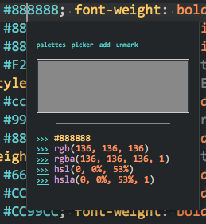
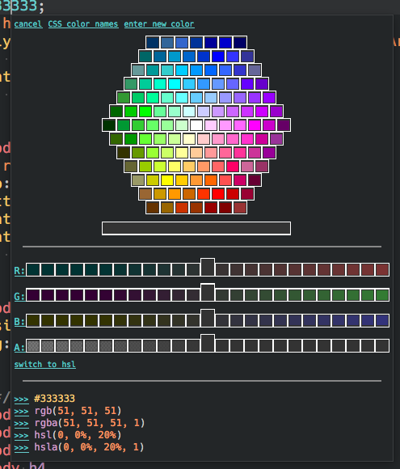
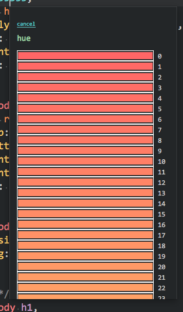
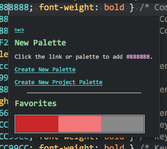
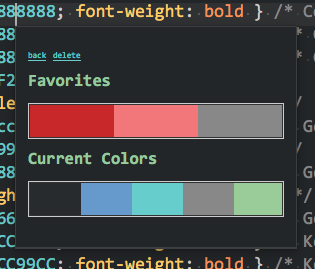
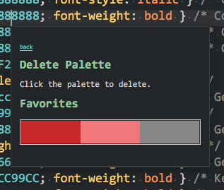
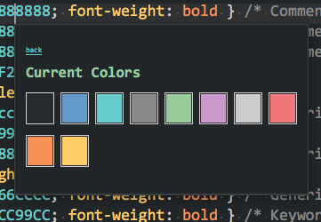

# User Guide {: .doctitle}
Configuration and usage of ColorHelper.

---

## General Usage
ColorHelper is a CSS/SCSS/Sass tooltip.  When the cursor is on a CSS color, the tooltip will appear. When entering a color into a supported file, the color palette panel will be triggered so you can optionally insert a color from a saved palette.  The panel will popup after either: `#`, `rgb(`, `rgba(`, `hsl(` or `hsla(`.

## Color Info
The Color Info Panel will show a preview of the color, and other format variations of the color such as: color name, hex, rgb, rgba, hsl, and hsla format; if desired, you can convert the selected color to one of the shown formats by clicking the link to the left.



From the color info panel, you can launch a color picker, bookmark colors as a favorite, add/save the current color to a palette of your choice, or open the [Palette Panel](#palette-panel) to select a pre-saved color from an exiting palette.

## Color Picker
The internal color picker can be launched from the command palette or from the [Color Info Panel](#color_info).  When launched it will use the color under the cursor (if available) as its starting color. The internal color picker is contained inside a tooltip.  It has a color map section at the top where different colors can be selected. It shows various valid CSS formats of the colors at the bottom.  And it shows either rgba channels or hlsa channels; a toggle is available to switch between them.



The color channels are coarse, but can generally allow you to get close to a color that you like.  As you select colors in the channel the selections will shift revealing more selections until the bounds of the color channel are reached.  If you need finer selections, you can click the label to the left and scrollable tooltip with much finer selections will appear so that you can select the best suited value.



If you would like to directly enter a different color, you can select the `enter new color` option.  An input panel will be open that can receive a color in the hex form of `#RRGGBBAA` where `RR` is the red channel, `GG` is the green channel, `BB` is the blue channel, and `AA` is the alpha channel.

## Add Color Panel
The Add Color Panel presents the user with the option of either adding a color to an existing palette or creating a new global or project palette and adding the color to it.



When creating a new palette, the user will be presented with a input box to type the name of the palette to create.

## Palette Panel
The Palette panel will allow you to view the current saved palettes: favorites, saved user palette, and saved project palettes.



The Favorites palette and user palettes are found in your `Packages/User/color_helper.palettes`.  Project palettes are stored in your actual project file; if one does not exist, it will be stored in memory.

By clicking a palette, you will be taken to the [Color Panel](#color-panel) to select a color to insert into the current document.  You can also access the [Palette Delete Panel](#palette-delete-panel) directly.

## Palette Delete Panel
The Palette Delete Panel allows a user to delete an existing palette.  The only palettes that cannot be deleted is the Favorites palette and the Current Colors palette (if enabled).



To delete a palette, a user simply clicks a palette and it will be removed.

## Color Panel
The Color Panel allows you to click a color to insert it at your current color position.



From the Color Palette, you can also bring up the [Color Delete Panel](#color-delete-panel).

## Color Delete Panel
The Color Delete Panel can delete any color from the given palette.  A user simply clicks the color to remove, and it will be removed.


## Settings
Settings for Color Helper are contained within the `color_helper.sublime-settings` file.

### upper_case_hex
When inserting a color from the tooltip, this setting will determine if hex colors get uppercased or lowercased.

```js
    // Upper case hex when inserting
    "upper_case_hex": false,
```

### use_webcolor_names
Will determine if a HTML color name will be shown for the currently selected colors. If inserting a web color name, transparency will be removed.

```js
    // Use webcolor names when value color matches a webcolor name.
    "use_webcolor_names": true,
```

### preferred_format
Controls color format that will be inserted into your document when selecting a color from a palette.  This will only affect colors that contain **no** transparency.

```js
    // Preferred format to output color as:
    // (none|hex|rgb|hsl)
    "preferred_format": "hex",
```

### preferred_alpha_format
Controls color format that will be inserted into your document when selecting a color from a palette.  This will only affect colors **with** transparency.

```js
    // Preferred alpha format to output color as:
    // (none|rgba|hsla)
    "preferred_alpha_format": "rgba",
```

### click_color_box_to_pick
This will make the color preview box in the [Color Info Panel](#color-info-panel) clickable.  When set to `color_picker` and clicked, it will open the color picker via the [ColorPicker](https://github.com/weslly/ColorPicker) plugin (if installed).  When set to `palette_picker` and clicked, it will open the [Palette Panel](#palette-panel). The respective menu item will not be shown in the [Color Info Panel](#color-info-panel) once relocated to the color preview.

```js
    // Color picker and palette picker by default
    // are accessed by clicking an icon on the color info panel.
    // Click access for one of thesecan be moved to the color box
    // (visual representation of the color).
    // (none|color_picker|palette_picker)
    "click_color_box_to_pick": "none",
```

### graphic_size
Controls the size of generated graphics.  Graphics in the tooltips look best large as Sublime slightly distorts images, but on small screens, some of the tooltips (especially the internal color picker) may be too large.  `graphic_size` can be used ot control the size of these generated images.  Valid settings are `small`, `medium`, and `large` where `medium` is the default.

```js
    // If the color picker is too big, try playing with this.
    // Graphics in tooltips usually look better bigger (especially in Hidpi),
    // but that can make the tooltips really big. If they are too big,
    // you can play with this setting.  We compromise with medium.
    // (small | medium | large)
    "graphic_size": "medium",
```

### enable_color_picker
Enables the ability to launch the color picker from the tooltip.  By default, the internal color picker will be used.  If you have [@weslly](https://github.com/weslly)'s [ColorPicker](https://packagecontrol.io/packages/ColorPicker) package installed, you can use [use_color_picker_package](#use_color_picker_package) to use it instead of the internal color picker.

```js
    // Enable color picker option.  Will use native color picker
    // unless "use_color_picker_package" is enabled and external
    // package is installed.
    "enable_color_picker": true,
```

### use_color_picker_package
If you have [@weslly](https://github.com/weslly)'s [ColorPicker](https://packagecontrol.io/packages/ColorPicker) package installed, `user_color_picker_package` will cause it to override the default color picker, but only the default color picker supports transparency.

```js
    // Use https://github.com/weslly/ColorPicker for the color picker if installed.
    "use_color_picker_package": false,
```

### enable_global_user_palettes
Enables showing user palettes (found in `Packages/User/color_helper.palettes`) in the [Palette Panel](#palette-panel).

```js
    // Show global palettes in palette panel
    "enable_global_user_palettes": true,
```

### enable_favorite_palette
Enables showing the Favorites palette (found in `Packages/User/color_helper.palettes`) in the [Palette Panel](#palette-panel).

```js
    // Enable storing favorite colors to the favorite palette
    "enable_favorite_palette": true,
```

### enable_current_file_palette
Enables scanning of the current active view buffer for colors and showing them in the Current Colors palette in the [Palette Panel](#palette-panel).

```js
    // Enable showing current file color palette
    "enable_current_file_palette": true,
```

### enable_project_user_palettes
Enables showing and storing of user palettes in the project file.  Project palettes will be shown in the [Palette Panel](#palette-panel).

```js
    // Enable project palettes in palette panel (Palettes stored in project file).
    "enable_project_user_palettes": true
```

### enable_color_conversions
Enables showing the color conversion options on the [Color Info Panel](#color-info-panel).

```js
    // Enable color conversion options on color info panel
    "enable_color_conversions": true,
```

### supported_syntax
`supported_syntax` is a list of scope rules that will be scanned when [enable_current_file_palette](#enable_current_file_palette) is enabled.  If a color is found within these scope rules, it will be indexed for the current file and shown in the Current Colors Panel in the [Palette Panel](#palette-panel).

```js
    // File scoping that will be used when indexing colors in an opened or saved file.
    // These are the syntaxes which the auto popup tooltip uses to recogize scannable regions.
    "supported_syntax": [
        "meta.property-value.css -comment -string",          // CSS, CSS in HTML etc. (based on: Sublime Default)
        "meta.value.css -comment -string",                   // CSS3, CSS3 in HTML etc. (based on: https://packagecontrol.io/packages/CSS3)
        "meta.property-list.css.sass -comment -string",      // Sass and SCSS (based on: https://packagecontrol.io/packages/Syntax%20Highlighting%20for%20Sass)
        "sass-script-maps -variable.other -comment -string", // Sass and SCSS script maps (based on: https://packagecontrol.io/packages/Syntax%20Highlighting%20for%20Sass)
        "meta.tag.inline.any.html string.quoted"             // HTML attributes (based on: Sublime Default)
    ],
```
